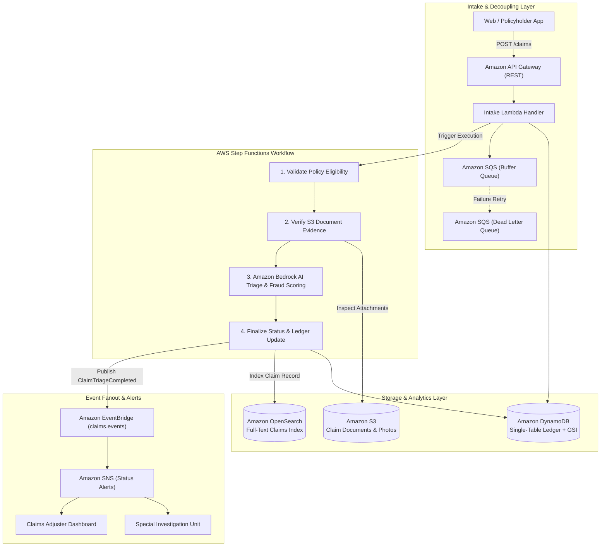

# AWS Serverless Claims Orchestration Pipeline

[](https://github.com/awanish5101/aws-serverless-claims-orchestrator/actions)
[](https://www.terraform.io/)
[](https://www.python.org/downloads/)
[](https://aws.amazon.com/step-functions/)
[](https://aws.amazon.com/bedrock/)

An event-driven serverless claims processing and document orchestration architecture built on AWS. Designed for insurance and financial services carriers, this pipeline automates First Notice of Loss (FNOL) intake, policy validation, document attachment processing, AI triage via Amazon Bedrock, and status event fanout across Amazon EventBridge and SNS.

---

## Architecture Overview



---

## Core Capabilities & AWS Services

### 1. Event-Driven Serverless Pipeline
* **AWS Step Functions:** Orchestrates multi-step distributed transactions using Amazon States Language (ASL), including retry backoffs and conditional branch handling for policy rejections.
* **Amazon EventBridge:** Emits structured domain events (`ClaimSubmitted`, `ClaimTriageCompleted`) onto a custom event bus (`claims.events`) to decouple downstream consumers.
* **Amazon SQS & SNS:** SQS acts as a resilient ingestion buffer with dead-letter queue (DLQ) isolation; SNS fans out real-time alerts to adjusters and customer notification channels.

### 2. Generative AI Triage with Amazon Bedrock
* **First Notice of Loss (FNOL) Summarization:** Uses Anthropic Claude 3 / Amazon Titan via Amazon Bedrock to extract key loss drivers, verify incident consistency, and generate structured claim summaries.
* **Automated Fraud Scoring:** Computes risk heuristics based on damage type, policy duration, and red-flag indicators, routing high-risk files directly to the Special Investigation Unit (SIU).

### 3. Single-Table Ledger on Amazon DynamoDB
* **Single-Table Design:** Implements high-throughput partition and sort keys:
  * Partition Key: `PK = CLAIM#{claim_id}`
  * Sort Key: `SK = METADATA`
  * Global Secondary Index: `GSI1PK = POLICY#{policy_number}` | `GSI1SK = STATUS#{status}`
* Enables constant-time lookups by claim ID and filtered queries for all claims under a specific policy.

### 4. Modular Infrastructure as Code (Terraform)
* Complete cloud infrastructure provisioned via Terraform modules:
  * DynamoDB single-table with Point-In-Time Recovery (PITR) and Streams.
  * Encrypted S3 bucket with public access block.
  * EventBridge custom bus, rules, and SQS/SNS integration.
  * Step Functions state machine with least-privilege IAM roles.

---

## Directory Structure

```text
aws-serverless-claims-orchestrator/
├── .github/
│   └── workflows/
│       └── ci.yml                     # GitHub Actions CI for test & terraform format
├── src/
│   ├── handlers/
│   │   ├── intake_handler.py          # REST API Gateway intake Lambda
│   │   ├── validation_handler.py      # Policy verification task
│   │   ├── document_handler.py        # S3 document metadata task
│   │   ├── triage_handler.py          # Amazon Bedrock AI triage task
│   │   └── settlement_handler.py      # Final settlement & event emission task
│   ├── models/
│   │   └── claim.py                   # Pydantic data models & DynamoDB mapping
│   └── services/
│       ├── dynamodb_service.py        # Single-table DynamoDB repository
│       ├── bedrock_service.py         # Amazon Bedrock AI runtime client
│       └── eventbridge_service.py     # EventBridge & SNS messaging client
├── statemachine/
│   └── claims_workflow.asl.json       # Amazon States Language definition
├── terraform/
│   ├── main.tf                        # Provider & S3 resource configuration
│   ├── dynamodb.tf                    # DynamoDB Single-Table definition
│   ├── eventbridge_sqs_sns.tf         # EventBridge, SQS, and SNS resources
│   ├── step_functions.tf              # Step Functions State Machine definition
│   ├── variables.tf                   # Input variables
│   └── outputs.tf                     # Stack outputs
├── tests/
│   ├── conftest.py                    # Moto AWS mock fixtures
│   ├── test_bedrock_service.py        # Bedrock triage unit tests
│   ├── test_dynamodb_service.py       # DynamoDB single-table tests
│   ├── test_eventbridge_sns.py        # EventBridge & SNS tests
│   ├── test_intake_handler.py         # REST intake Lambda tests
│   └── test_step_functions_pipeline.py# End-to-end Step Functions tests
├── Dockerfile                         # Container image for Lambda deployment
├── docker-compose.yml                 # LocalStack container configuration
├── pytest.ini                         # Pytest configuration
├── requirements.txt                   # Project dependencies
└── .env.example                       # Environment variable template
```

---

## Quickstart

### Prerequisites
* Python 3.11+
* Git
* Terraform 1.5+ (optional for deployments)
* Docker (optional for LocalStack)

### 1. Local Setup

```bash
git clone https://github.com/awanish5101/aws-serverless-claims-orchestrator.git
cd aws-serverless-claims-orchestrator

python3 -m venv venv
source venv/bin/activate
pip install -r requirements.txt
```

### 2. Run Automated Test Suite

Run the full automated test suite with simulated AWS mocks:

```bash
pytest tests/ -v
```

All 11 tests validate DynamoDB single-table operations, Bedrock triage heuristics, EventBridge bus delivery, SQS DLQ behavior, and end-to-end Step Functions execution.

### 3. Deploy with Terraform

```bash
cd terraform
terraform init
terraform plan
terraform apply
```

---

## Example Claim Payload

```json
{
  "policy_number": "POL-98765432",
  "insured_name": "Jane Doe",
  "claim_type": "AUTO",
  "incident_date": "2026-09-25",
  "incident_location": "Bloomington, IL",
  "incident_description": "Rear-ended at traffic signal. Front bumper cracked and radiator leaking.",
  "estimated_damage_amount": 4200.0,
  "documents": [
    {
      "document_id": "DOC-101",
      "s3_bucket": "serverless-claims-documents-prod",
      "s3_key": "claims/photos/bumper_damage.jpg",
      "file_type": "image/jpeg",
      "file_size_bytes": 1048576,
      "uploaded_at": "2026-09-25T14:30:00Z"
    }
  ]
}
```

---

## License

This project is licensed under the MIT License.
